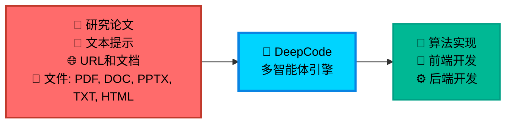

<div align="center">

<table style="border: none; margin: 0 auto; padding: 0; border-collapse: collapse;">
<tr>
<td align="center" style="vertical-align: middle; padding: 10px; border: none; width: 250px;">
  
</td>
<td align="left" style="vertical-align: middle; padding: 10px 0 10px 30px; border: none;">
  <pre style="font-family: 'Courier New', monospace; font-size: 16px; color: #0EA5E9; margin: 0; padding: 0; text-shadow: 0 0 10px #0EA5E9, 0 0 20px rgba(14,165,233,0.5); line-height: 1.2; transform: skew(-1deg, 0deg); display: block;">    ██████╗ ███████╗███████╗██████╗  ██████╗ ██████╗ ██████╗ ███████╗
    ██╔══██╗██╔════╝██╔════╝██╔══██╗██╔════╝██╔═══██╗██╔══██╗██╔════╝
    ██║  ██║█████╗  █████╗  ██████╔╝██║     ██║   ██║██║  ██║█████╗
    ██║  ██║██╔══╝  ██╔══╝  ██╔═══╝ ██║     ██║   ██║██║  ██║██╔══╝
    ██████╔╝███████╗███████╗██║     ╚██████╗╚██████╔╝██████╔╝███████╗
    ╚═════╝ ╚══════╝╚══════╝╚═╝      ╚═════╝ ╚═════╝ ╚═════╝ ╚══════╝</pre>
</td>
</tr>
</table>

<div align="center">
<a href="https://trendshift.io/repositories/14665" target="_blank"></a>
</div>

<!--  -->

#  DeepCode: 开源智能体编程

### *基于多智能体系统推进代码生成技术*

<!-- <p align="center">
  

  
  
  
</p> -->
<p>
  <a href="https://github.com/HKUDS/DeepCode/stargazers"></a>
  
  <a href="https://pypi.org/project/deepcode-hku/"></a>
</p>
<p>
  <a href="https://discord.gg/yF2MmDJyGJ"></a>
  <a href="https://github.com/HKUDS/DeepCode/issues/11"></a>
</p>
<div align="center">
  <div style="width: 100%; height: 2px; margin: 20px 0; background: linear-gradient(90deg, transparent, #00d9ff, transparent);"></div>
</div>

<div align="center">
  <a href="#-快速开始" style="text-decoration: none;">
    
  </a>
</div>

### 🖥️ **界面展示**

<table align="center" width="100%" style="border: none; border-collapse: collapse; margin: 30px 0;">
<tr>
<td width="50%" align="center" style="vertical-align: top; padding: 20px;">

#### 🖥️ **命令行界面**
**基于终端的开发环境**

<div align="center">

  

  <div style="background: linear-gradient(135deg, #2D3748 0%, #4A5568 100%); border-radius: 12px; padding: 15px; margin: 15px 0; color: white;">
    <strong>🚀 高级终端体验</strong><br/>
    <small>⚡ 快速命令行工作流<br/>🔧 开发者友好界面<br/>📊 实时进度跟踪</small>
  </div>

  *专业终端界面，适合高级用户和CI/CD集成*
</div>

</td>
<td width="50%" align="center" style="vertical-align: top; padding: 20px;">

#### 🌐 **Web界面**
**可视化交互体验**

<div align="center">

  

  <div style="background: linear-gradient(135deg, #0EA5E9 0%, #00D4FF 100%); border-radius: 12px; padding: 15px; margin: 15px 0; color: white;">
    <strong>🎨 现代化Web仪表板</strong><br/>
    <small>🖱️ 直观的拖拽操作<br/>📱 响应式设计<br/>🎯 可视化进度跟踪</small>
  </div>

  *美观的Web界面，为所有技能水平用户提供流畅的工作流程*
</div>

</td>
</tr>
</table>

---

<div align="center">

### 🎬 **介绍视频**

<div style="margin: 20px 0;">
  <a href="https://youtu.be/PRgmP8pOI08" target="_blank">
    
  </a>
</div>

*🎯 **观看我们的完整介绍** - 了解DeepCode如何将研究论文和自然语言转换为生产就绪的代码*

<p>
  <a href="https://youtu.be/PRgmP8pOI08" target="_blank">
    
  </a>
</p>

</div>

---


> *"AI智能体将创意转化为生产就绪代码的地方"*

</div>

---

## 📑 目录

- [🚀 核心特性](#-核心特性)
- [🏗️ 架构](#️-架构)
- [🚀 快速开始](#-快速开始)
- [💡 示例](#-示例)
  - [🎬 实时演示](#-实时演示)
- [⭐ 星标历史](#-星标历史)
- [📄 许可证](#-许可证)

---

## 🚀 核心特性

<br/>

<table align="center" width="100%" style="border: none; table-layout: fixed;">
<tr>
<td width="30%" align="center" style="vertical-align: top; padding: 20px;">

<div style="height: 80px; display: flex; align-items: center; justify-content: center;">
<h3 style="margin: 0; padding: 0;">🚀 <strong>论文转代码</strong></h3>
</div>

<div align="center" style="margin: 15px 0;">
  
</div>

<div style="height: 80px; display: flex; align-items: center; justify-content: center;">
<p align="center"><strong>复杂算法的自动化实现</strong></p>
</div>

<div style="height: 60px; display: flex; align-items: center; justify-content: center;">
<p align="center">轻松将研究论文中的复杂算法转换为<strong>高质量</strong>、<strong>生产就绪</strong>的代码，加速算法复现。</p>
</div>


</td>
<td width="30%" align="center" style="vertical-align: top; padding: 20px;">

<div style="height: 80px; display: flex; align-items: center; justify-content: center;">
<h3 style="margin: 0; padding: 0;">🎨 <strong>文本转Web</strong></h3>
</div>

<div align="center" style="margin: 15px 0;">
  
</div>

<div style="height: 80px; display: flex; align-items: center; justify-content: center;">
<p align="center"><strong>自动化前端Web开发</strong></p>
</div>

<div style="height: 60px; display: flex; align-items: center; justify-content: center;">
<p align="center">将纯文本描述转换为<strong>功能完整</strong>、<strong>视觉美观</strong>的前端Web代码，快速创建界面。</p>
</div>


</td>
<td width="30%" align="center" style="vertical-align: top; padding: 20px;">

<div style="height: 80px; display: flex; align-items: center; justify-content: center;">
<h3 style="margin: 0; padding: 0;">⚙️ <strong>文本转后端</strong></h3>
</div>

<div align="center" style="margin: 15px 0;">
  
</div>

<div style="height: 80px; display: flex; align-items: center; justify-content: center;">
<p align="center"><strong>自动化后端开发</strong></p>
</div>

<div style="height: 60px; display: flex; align-items: center; justify-content: center;">
<p align="center">从简单的文本输入生成<strong>高效</strong>、<strong>可扩展</strong>和<strong>功能丰富</strong>的后端代码，简化服务器端开发。</p>
</div>


</td>
</tr>
</table>

<br/>

### 🎯 **自主多智能体工作流**

**面临的挑战**:

- 📄 **实现复杂性**: 将学术论文和复杂算法转换为可运行代码需要大量技术投入和领域专业知识

- 🔬 **研究瓶颈**: 研究人员将宝贵时间花在算法实现上，而不是专注于核心研究和发现工作

- ⏱️ **开发延迟**: 产品团队在概念和可测试原型之间经历长时间等待，减慢创新周期

- 🔄 **重复编码**: 开发者重复实现相似的模式和功能，而不是基于现有解决方案构建

**DeepCode** 通过为常见开发任务提供可靠的自动化来解决这些工作流程低效问题，简化从概念到代码的开发工作流程。

<div align="center">



</div>

---

## 🏗️ 架构

### 📊 **系统概述**

**DeepCode** 是一个AI驱动的开发平台，自动化代码生成和实现任务。我们的多智能体系统处理将需求转换为功能性、结构良好代码的复杂性，让您专注于创新而非实现细节。

🎯 **技术能力**:

🧬 **研究到生产流水线**<br>
多模态文档分析引擎，从学术论文中提取算法逻辑和数学模型。生成优化的实现，使用适当的数据结构，同时保持计算复杂度特征。

🪄 **自然语言代码合成**<br>
使用在精选代码库上训练的微调语言模型进行上下文感知代码生成。在支持多种编程语言和框架的同时保持模块间架构一致性。

⚡ **自动化原型引擎**<br>
智能脚手架系统，生成包括数据库模式、API端点和前端组件的完整应用程序结构。使用依赖分析确保从初始生成开始的可扩展架构。

💎 **质量保证自动化**<br>
集成静态分析与自动化单元测试生成和文档合成。采用AST分析进行代码正确性检查和基于属性的测试进行全面覆盖。

🔮 **CodeRAG集成系统**<br>
高级检索增强生成，结合语义向量嵌入和基于图的依赖分析。从大规模代码语料库中自动发现最优库和实现模式。

---

### 🔧 **核心技术**

- 🧠 **智能编排智能体**: 协调工作流阶段和分析需求的中央决策系统。采用动态规划算法，根据不断发展的项目复杂性实时调整执行策略。为每个实现步骤动态选择最优处理策略。 <br>

- 💾 **高效内存机制**: 高效管理大规模代码上下文的高级上下文工程系统。实现分层内存结构，具有智能压缩功能，用于处理复杂代码库。该组件实现实现模式的即时检索，并在扩展开发会话中保持语义一致性。 <br>

- 🔍 **高级CodeRAG系统**: 分析跨存储库复杂相互依赖关系的全局代码理解引擎。执行跨代码库关系映射，从整体角度理解架构模式。该模块利用依赖图和语义分析在实现过程中提供全局感知的代码建议。

---

### 🤖 **DeepCode的多智能体架构**:

- **🎯 中央编排智能体**: 编排整个工作流程执行并做出战略决策。基于输入复杂性分析协调专门智能体。实现动态任务规划和资源分配算法。 <br>

- **📝 意图理解智能体**: 对用户需求进行深度语义分析以解码复杂意图。通过高级NLP处理提取功能规范和技术约束。通过结构化任务分解将模糊的人类描述转换为精确、可操作的开发规范。 <br>

- **📄 文档解析智能体**: 使用高级解析能力处理复杂的技术文档和研究论文。使用文档理解模型提取算法和方法。通过智能内容分析将学术概念转换为实用的实现规范。 <br>

- **🏗️ 代码规划智能体**: 执行架构设计和技术栈优化。动态规划适应性开发路线图。通过自动化设计模式选择执行编码标准并生成模块化结构。<br>

- **🔍 代码参考挖掘智能体**: 通过智能搜索算法发现相关存储库和框架。分析代码库的兼容性和集成潜力。基于相似性度量和自动化依赖分析提供建议。 <br>

- **📚 代码索引智能体**: 构建发现代码库的综合知识图谱。维护代码组件之间的语义关系。实现智能检索和交叉引用能力。 <br>

- **🧬 代码生成智能体**: 将收集的信息合成为可执行的代码实现。创建功能接口并集成发现的组件。生成全面的测试套件和文档以确保可重现性。

---

#### 🛠️ **实现工具矩阵**

**🔧 基于MCP (模型上下文协议) 驱动**

DeepCode利用**模型上下文协议 (MCP)** 标准与各种工具和服务无缝集成。这种标准化方法确保AI智能体和外部系统之间的可靠通信，实现强大的自动化能力。

##### 📡 **MCP服务器和工具**

| 🛠️ **MCP服务器** | 🔧 **主要功能** | 💡 **目的和能力** |
|-------------------|-------------------------|-------------------------------|
| **🔍 brave** | Web搜索引擎 | 通过Brave搜索API进行实时信息检索 |
| **🌐 bocha-mcp** | 替代搜索 | 具有独立API访问的辅助搜索选项 |
| **📂 filesystem** | 文件系统操作 | 本地文件和目录管理，读/写操作 |
| **🌐 fetch** | Web内容检索 | 从URL和Web资源获取和提取内容 |
| **📥 github-downloader** | 存储库管理 | 克隆和下载GitHub存储库进行分析 |
| **📋 file-downloader** | 文档处理 | 下载文件(PDF、DOCX等)并转换为Markdown |
| **⚡ command-executor** | 系统命令 | 执行bash/shell命令进行环境管理 |
| **🧬 code-implementation** | 代码生成中心 | 具有执行和测试的综合代码复现 |
| **📚 code-reference-indexer** | 智能代码搜索 | 代码存储库的智能索引和搜索 |
| **📄 document-segmentation** | 智能文档分析 | 大型论文和技术文档的智能文档分割 |

##### 🔧 **传统工具功能** *(供参考)*

| 🛠️ **功能** | 🎯 **使用上下文** |
|-----------------|---------------------|
| **📄 read_code_mem** | 从内存高效检索代码上下文 |
| **✍️ write_file** | 直接文件内容生成和修改 |
| **🐍 execute_python** | Python代码测试和验证 |
| **📁 get_file_structure** | 项目结构分析和组织 |
| **⚙️ set_workspace** | 动态工作空间和环境配置 |
| **📊 get_operation_history** | 过程监控和操作跟踪 |


---

🎛️ **多界面框架**<br>
具有CLI和Web前端的RESTful API，具有实时代码流、交互式调试和可扩展插件架构，用于CI/CD集成。

**🚀 多智能体智能流水线:**

<div align="center">

### 🌟 **智能处理流程**

<table align="center" width="100%" style="border: none; border-collapse: collapse;">
<tr>
<td colspan="3" align="center" style="padding: 20px; background: linear-gradient(135deg, #667eea 0%, #764ba2 100%); border-radius: 15px; color: white; font-weight: bold;">
💡 <strong>输入层</strong><br/>
📄 研究论文 • 💬 自然语言 • 🌐 URL • 📋 需求
</td>
</tr>
<tr><td colspan="3" height="20"></td></tr>
<tr>
<td colspan="3" align="center" style="padding: 15px; background: linear-gradient(135deg, #ff6b6b 0%, #ee5a24 100%); border-radius: 12px; color: white; font-weight: bold;">
🎯 <strong>中央编排</strong><br/>
战略决策制定 • 工作流程协调 • 智能体管理
</td>
</tr>
<tr><td colspan="3" height="15"></td></tr>
<tr>
<td align="center" style="padding: 12px; background: linear-gradient(135deg, #3742fa 0%, #2f3542 100%); border-radius: 10px; color: white; width: 50%;">
📝 <strong>文本分析</strong><br/>
<small>需求处理</small>
</td>
<td width="10"></td>
<td align="center" style="padding: 12px; background: linear-gradient(135deg, #8c7ae6 0%, #9c88ff 100%); border-radius: 10px; color: white; width: 50%;">
📄 <strong>文档分析</strong><br/>
<small>论文和规范处理</small>
</td>
</tr>
<tr><td colspan="3" height="15"></td></tr>
<tr>
<td colspan="3" align="center" style="padding: 15px; background: linear-gradient(135deg, #00d2d3 0%, #54a0ff 100%); border-radius: 12px; color: white; font-weight: bold;">
📋 <strong>复现规划</strong><br/>
深度论文分析 • 代码需求解析 • 复现策略开发
</td>
</tr>
<tr><td colspan="3" height="15"></td></tr>
<tr>
<td align="center" style="padding: 12px; background: linear-gradient(135deg, #ffa726 0%, #ff7043 100%); border-radius: 10px; color: white; width: 50%;">
🔍 <strong>参考分析</strong><br/>
<small>存储库发现</small>
</td>
<td width="10"></td>
<td align="center" style="padding: 12px; background: linear-gradient(135deg, #e056fd 0%, #f368e0 100%); border-radius: 10px; color: white; width: 50%;">
📚 <strong>代码索引</strong><br/>
<small>知识图谱构建</small>
</td>
</tr>
<tr><td colspan="3" height="15"></td></tr>
<tr>
<td colspan="3" align="center" style="padding: 15px; background: linear-gradient(135deg, #26de81 0%, #20bf6b 100%); border-radius: 12px; color: white; font-weight: bold;">
🧬 <strong>代码实现</strong><br/>
实现生成 • 测试 • 文档
</td>
</tr>
<tr><td colspan="3" height="15"></td></tr>
<tr>
<td colspan="3" align="center" style="padding: 20px; background: linear-gradient(135deg, #045de9 0%, #09c6f9 100%); border-radius: 15px; color: white; font-weight: bold;">
⚡ <strong>输出交付</strong><br/>
📦 完整代码库 • 🧪 测试套件 • 📚 文档 • 🚀 部署就绪
</td>
</tr>
</table>

</div>

<div align="center">
<br/>

### 🔄 **流程智能特性**

<table align="center" style="border: none;">
<tr>
<td align="center" width="25%" style="padding: 15px;">
<div style="background: #f8f9fa; border-radius: 10px; padding: 15px; border-left: 4px solid #ff6b6b;">
<h4>🎯 自适应流程</h4>
<p><small>基于输入复杂性的动态智能体选择</small></p>
</div>
</td>
<td align="center" width="25%" style="padding: 15px;">
<div style="background: #f8f9fa; border-radius: 10px; padding: 15px; border-left: 4px solid #4ecdc4;">
<h4>🧠 智能协调</h4>
<p><small>智能任务分配和并行处理</small></p>
</div>
</td>
<td align="center" width="25%" style="padding: 15px;">
<div style="background: #f8f9fa; border-radius: 10px; padding: 15px; border-left: 4px solid #45b7d1;">
<h4>🔍 上下文感知</h4>
<p><small>通过CodeRAG集成的深度理解</small></p>
</div>
</td>
<td align="center" width="25%" style="padding: 15px;">
<div style="background: #f8f9fa; border-radius: 10px; padding: 15px; border-left: 4px solid #96ceb4;">
<h4>⚡ 质量保证</h4>
<p><small>全程自动化测试和验证</small></p>
</div>
</td>
</tr>
</table>

</div>

---

## 🚀 快速开始


### 📦 **步骤1: 安装**

#### ⚡ **直接安装 (推荐)**

```bash
# 🚀 直接安装DeepCode包
pip install deepcode-hku

# 🔑 下载配置文件
curl -O https://raw.githubusercontent.com/HKUDS/DeepCode/main/mcp_agent.config.yaml
curl -O https://raw.githubusercontent.com/HKUDS/DeepCode/main/mcp_agent.secrets.yaml

# 🔑 配置API密钥 (必需)
# 使用您的API密钥和base_url编辑mcp_agent.secrets.yaml:
# - openai: api_key, base_url (用于OpenAI/自定义端点)
# - anthropic: api_key (用于Claude模型)

# 🔑 配置搜索API密钥用于Web搜索 (可选)
# 编辑mcp_agent.config.yaml设置您的API密钥:
# - 对于Brave搜索: 在brave.env部分设置BRAVE_API_KEY: "your_key_here" (第~28行)
# - 对于Bocha-MCP: 在bocha-mcp.env部分设置BOCHA_API_KEY: "your_key_here" (第~74行)

# 📄 配置文档分割 (可选)
# 编辑mcp_agent.config.yaml控制文档处理:
# - enabled: true/false (是否使用智能文档分割)
# - size_threshold_chars: 50000 (触发分割的文档大小阈值)
```

#### 🔧 **开发安装 (从源码)**

<details>
<summary><strong>📂 点击展开开发安装选项</strong></summary>

##### 🔥 **使用UV (开发推荐)**

```bash
# 🔽 克隆存储库
git clone https://github.com/HKUDS/DeepCode.git
cd DeepCode/

# 📦 安装UV包管理器
curl -LsSf https://astral.sh/uv/install.sh | sh

# 🔧 使用UV安装依赖
uv venv --python=3.13
source .venv/bin/activate  # Windows下: .venv\Scripts\activate
uv pip install -r requirements.txt

# 🔑 配置API密钥 (必需)
# 使用您的API密钥和base_url编辑mcp_agent.secrets.yaml:
# - openai: api_key, base_url (用于OpenAI/自定义端点)
# - anthropic: api_key (用于Claude模型)

# 🔑 配置搜索API密钥用于Web搜索 (可选)
# 编辑mcp_agent.config.yaml设置您的API密钥:
# - 对于Brave搜索: 在brave.env部分设置BRAVE_API_KEY: "your_key_here" (第~28行)
# - 对于Bocha-MCP: 在bocha-mcp.env部分设置BOCHA_API_KEY: "your_key_here" (第~74行)

# 📄 配置文档分割 (可选)
# 编辑mcp_agent.config.yaml控制文档处理:
# - enabled: true/false (是否使用智能文档分割)
# - size_threshold_chars: 50000 (触发分割的文档大小阈值)
```

##### 🐍 **使用传统pip**

```bash
# 🔽 克隆存储库
git clone https://github.com/HKUDS/DeepCode.git
cd DeepCode/

# 📦 安装依赖
pip install -r requirements.txt

# 🔑 配置API密钥 (必需)
# 使用您的API密钥和base_url编辑mcp_agent.secrets.yaml:
# - openai: api_key, base_url (用于OpenAI/自定义端点)
# - anthropic: api_key (用于Claude模型)

# 🔑 配置搜索API密钥用于Web搜索 (可选)
# 编辑mcp_agent.config.yaml设置您的API密钥:
# - 对于Brave搜索: 在brave.env部分设置BRAVE_API_KEY: "your_key_here" (第~28行)
# - 对于Bocha-MCP: 在bocha-mcp.env部分设置BOCHA_API_KEY: "your_key_here" (第~74行)

# 📄 配置文档分割 (可选)
# 编辑mcp_agent.config.yaml控制文档处理:
# - enabled: true/false (是否使用智能文档分割)
# - size_threshold_chars: 50000 (触发分割的文档大小阈值)
```

</details>

#### 🪟 **Windows用户: 额外的MCP服务器配置**

如果您使用Windows，可能需要在`mcp_agent.config.yaml`中手动配置MCP服务器:

```bash
# 1. 全局安装MCP服务器
npm i -g @modelcontextprotocol/server-brave-search
npm i -g @modelcontextprotocol/server-filesystem

# 2. 找到您的全局node_modules路径
npm -g root
```

然后更新您的`mcp_agent.config.yaml`使用绝对路径:

```yaml
mcp:
  servers:
    brave:
      command: "node"
      args: ["C:/Program Files/nodejs/node_modules/@modelcontextprotocol/server-brave-search/dist/index.js"]
    filesystem:
      command: "node"
      args: ["C:/Program Files/nodejs/node_modules/@modelcontextprotocol/server-filesystem/dist/index.js", "."]
```

> **注意**: 将路径替换为步骤2中您实际的全局node_modules路径。

#### 🔍 **搜索服务器配置 (可选)**

DeepCode支持多个搜索服务器进行Web搜索功能。您可以在`mcp_agent.config.yaml`中配置您的首选选项:

```yaml
# 默认搜索服务器配置
# 选项: "brave" 或 "bocha-mcp"
default_search_server: "brave"
```

**可用选项:**
- **🔍 Brave搜索** (`"brave"`):
  - 具有高质量搜索结果的默认选项
  - 需要BRAVE_API_KEY配置
  - 推荐给大多数用户

- **🌐 Bocha-MCP** (`"bocha-mcp"`):
  - 替代搜索服务器选项
  - 需要BOCHA_API_KEY配置
  - 使用本地Python服务器实现

**在mcp_agent.config.yaml中的API密钥配置:**
```yaml
# 对于Brave搜索 (默认) - 第28行左右
brave:
  command: "npx"
  args: ["-y", "@modelcontextprotocol/server-brave-search"]
  env:
    BRAVE_API_KEY: "your_brave_api_key_here"

# 对于Bocha-MCP (替代) - 第74行左右
bocha-mcp:
  command: "python"
  args: ["tools/bocha_search_server.py"]
  env:
    PYTHONPATH: "."
    BOCHA_API_KEY: "your_bocha_api_key_here"
```

> **💡 提示**: 两个搜索服务器都需要API密钥配置。选择最适合您的API访问和需求的选项。

### ⚡ **步骤2: 启动应用程序**

#### 🚀 **使用已安装的包 (推荐)**

```bash
# 🌐 直接启动Web界面
deepcode

# 应用程序将自动在 http://localhost:8501 启动
```

#### 🛠️ **使用源码**

选择您首选的界面:

##### 🌐 **Web界面** (推荐)
```bash
# 使用UV
uv run streamlit run ui/streamlit_app.py
# 或使用传统Python
streamlit run ui/streamlit_app.py
```
<div align="center">
  
</div>

##### 🖥️ **CLI界面** (高级用户)
```bash
# 使用UV
uv run python cli/main_cli.py
# 或使用传统Python
python cli/main_cli.py
```
<div align="center">
  
</div>

### 🎯 **步骤3: 生成代码**

1. **📄 输入**: 上传您的研究论文，提供需求，或粘贴URL
2. **🤖 处理**: 观看多智能体系统分析和规划
3. **⚡ 输出**: 接收带有测试和文档的生产就绪代码


  ---

## 💡 示例


### 🎬 **实时演示**


<table align="center">
<tr>
<td width="33%" align="center">

#### 📄 **论文转代码演示**
**研究到实现**

<div align="center">
  <a href="https://www.youtube.com/watch?v=MQZYpLkzsbw">
    
  </a>

  **[▶️ 观看演示](https://www.youtube.com/watch?v=MQZYpLkzsbw)**

  *自动将学术论文转换为生产就绪代码*
</div>

</td>
<td width="33%" align="center">

#### 🖼️ **图像处理演示**
**AI驱动的图像工具**

<div align="center">
  <a href="https://www.youtube.com/watch?v=nFt5mLaMEac">
    
  </a>

  **[▶️ 观看演示](https://www.youtube.com/watch?v=nFt5mLaMEac)**

  *智能图像处理，具有背景移除和增强功能*
</div>

</td>
<td width="33%" align="center">

#### 🌐 **前端实现**
**完整Web应用程序**

<div align="center">
  <a href="https://www.youtube.com/watch?v=78wx3dkTaAU">
    
  </a>

  **[▶️ 观看演示](https://www.youtube.com/watch?v=78wx3dkTaAU)**

  *从概念到部署的全栈Web开发*
</div>

</td>
</tr>
</table>


### 🆕 **最新更新**

#### 📄 **智能文档分割 (v1.2.0)**
- **智能处理**: 自动处理超出LLM令牌限制的大型研究论文和技术文档
- **可配置控制**: 通过配置切换分割功能，具有基于大小的阈值
- **语义分析**: 高级内容理解，保留算法、概念和公式
- **向后兼容**: 对较小文档无缝回退到传统处理

### 🚀 **即将推出**

我们正在不断增强DeepCode的令人兴奋的新功能:

#### 🔧 **增强的代码可靠性和验证**
- **自动化测试**: 具有执行验证和错误检测的全面功能测试。
- **代码质量保证**: 通过静态分析、动态测试和性能基准测试进行多级验证。
- **智能调试**: AI驱动的错误检测，具有自动纠正建议

#### 📊 **PaperBench性能展示**
- **基准仪表板**: PaperBench评估套件的综合性能指标。
- **准确性指标**: 与最先进的论文复现系统的详细比较。
- **成功分析**: 跨论文类别和复杂度水平的统计分析。

#### ⚡ **系统级优化**
- **性能提升**: 多线程处理和优化智能体协调，实现更快的生成。
- **增强推理**: 具有改进上下文理解的高级推理能力。
- **扩展支持**: 扩展与其他编程语言和框架的兼容性。

---

## ⭐ 星标历史

<div align="center">

*社区增长轨迹*

<a href="https://star-history.com/#HKUDS/DeepCode&Date">
  <picture>
    <source media="(prefers-color-scheme: dark)" srcset="https://api.star-history.com/svg?repos=HKUDS/DeepCode&type=Date&theme=dark" />
    <source media="(prefers-color-scheme: light)" srcset="https://api.star-history.com/svg?repos=HKUDS/DeepCode&type=Date" />
    
  </picture>
</a>

</div>

---

### 🚀 **准备好变革开发方式了吗？**

<div align="center">

<p>
  <a href="#-快速开始"></a>
  <a href="https://github.com/HKUDS"></a>
  <a href="https://github.com/HKUDS/deepcode-agent"></a>
</p>

---

### 📄 **许可证**


**MIT许可证** - 版权所有 (c) 2025 香港大学数据智能实验室

---


</div>
